# Conversor de Unidades

O Conversor de Unidades é uma ferramenta prática e essencial para converter diversas unidades de medida de forma rápida e precisa. Ideal para qualquer pessoa que necessite realizar conversões de unidades regularmente, este conversor é intuitivo e fácil de usar.

## Índice
- [Principais Funcionalidades](#principais-funcionalidades)
- [Tecnologias Utilizadas](#tecnologias-utilizadas)
- [Guia do Usuário](#guia-do-usuário)
- [Equipe](#equipe)

## Principais Funcionalidades

- ### Ampla Variedade de Unidades
  Suporta uma vasta gama de unidades em diferentes categorias, como comprimento, tempo, peso, corrente elétrica, temperatura, moeda, volume, dados e mais.

- ### Interface Intuitiva
  Permite que os usuários selecionem facilmente as unidades que desejam converter, insiram os valores e obtenham resultados instantaneamente.

- ### Precisão e Confiabilidade
  Utiliza algoritmos avançados para garantir que as conversões sejam precisas e confiáveis.

- ### Conversões Bidirecionais
  Permite converter de uma unidade para outra e vice-versa com a mesma facilidade, proporcionando flexibilidade e conveniência.

- ### Histórico de Conversões
  Armazena as últimas conversões realizadas, permitindo que os usuários revisem ou reutilizem conversões anteriores sem precisar repetir todo o processo.

## Tecnologias Utilizadas

O projeto foi inteiramente feito em linguagem C.

## Guia do Usuário

Para utilização do conversor de unidades faça os seguintes passos:

### 1. Clique na opção destacada

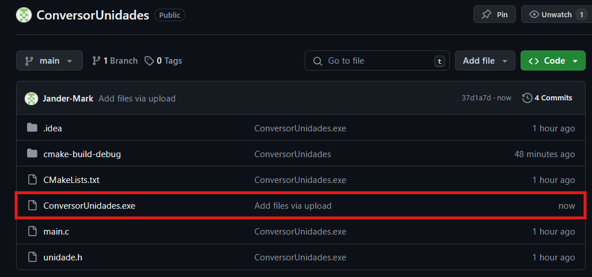

### 2. Baixe o arquivo

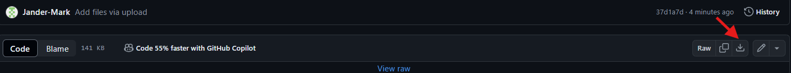

### 3. Abra o arquivo baixado

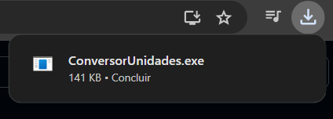

### 4. Clique no "Mais informações"

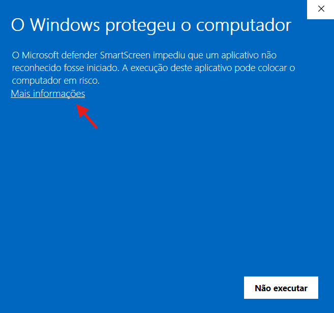

### 5. Clique em "Executar assim mesmo"

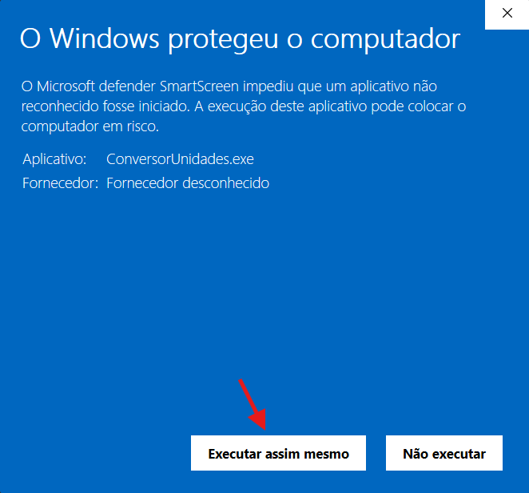

### 6. Menu Principal

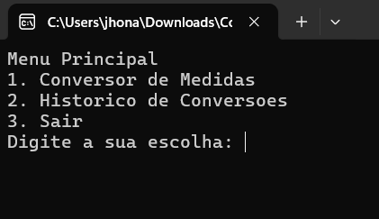

### 7. Convertendo unidades

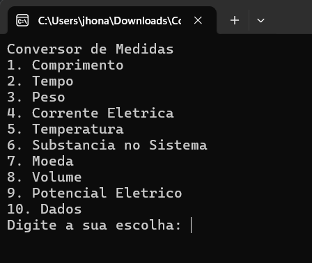

 Aqui aparecem todas as unidades disponíveis para conversão.

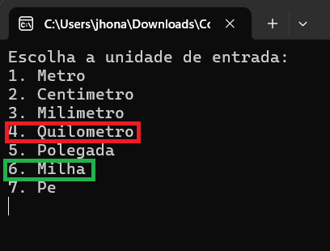

 Como exemplo, selecionamos a unidade comprimento, onde a opção 4 (vermelho) é a entrada, enquanto a 6 (verde) será a saída.

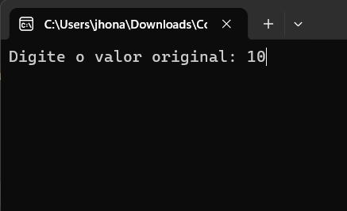

 Logo após, é solicitado o valor que o usuário deseja converter.

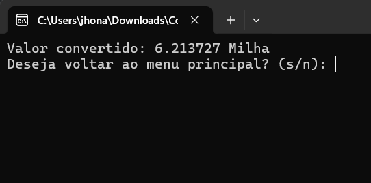

 Aqui é apresentado o valor convertido, e logo após, o programa apresenta a opção de voltar ao menu principal ou sair. 

## Histórico

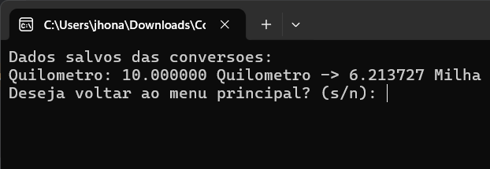
 Aqui foi escolhido a opção histórico (vide passo 6), onde constará as conversões realizadas. 

## Equipe

- Jander Mark
- Jhonata Pontes 
- Kleber Souza
- Matheus Felix

